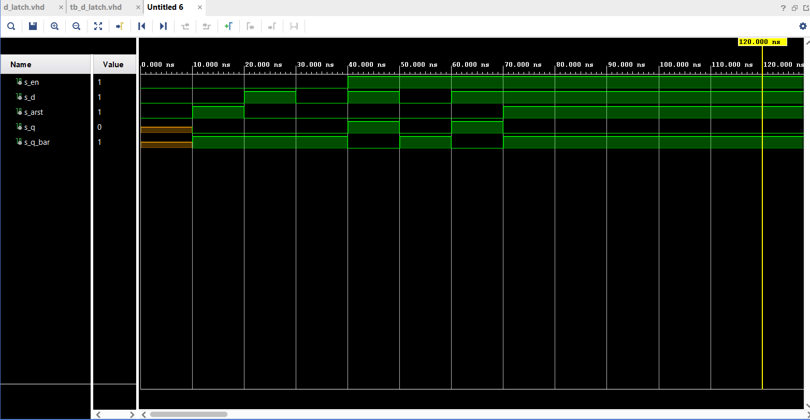
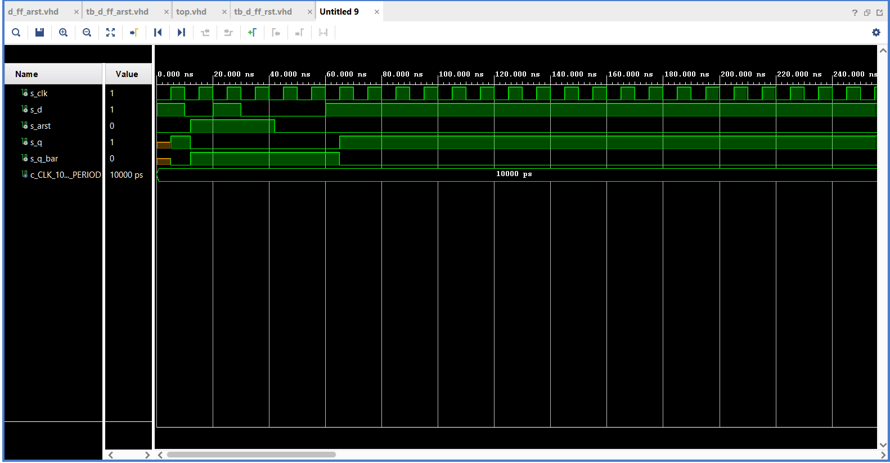
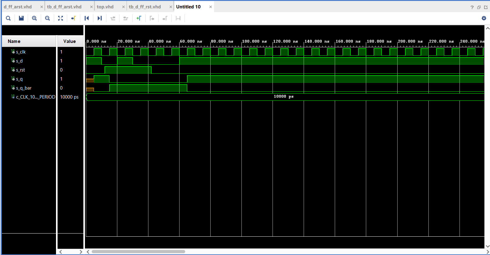
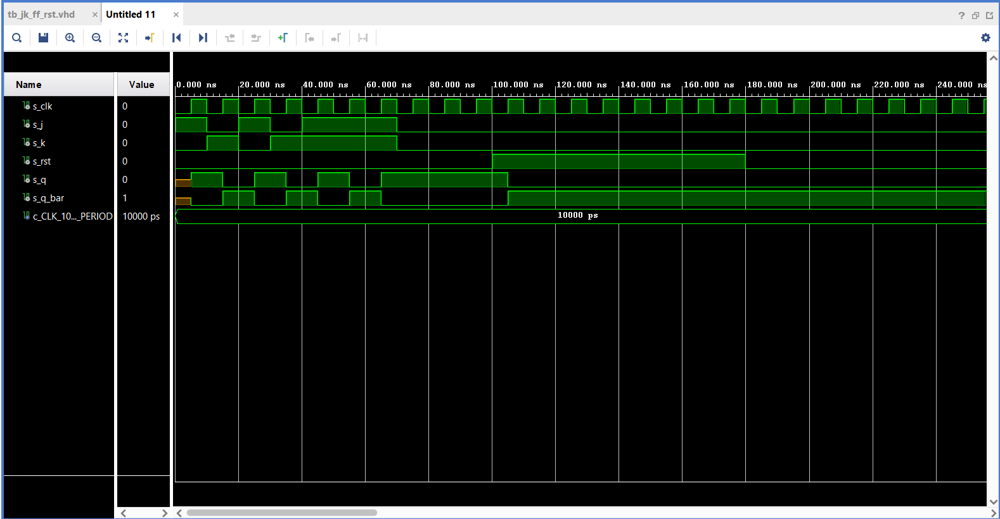
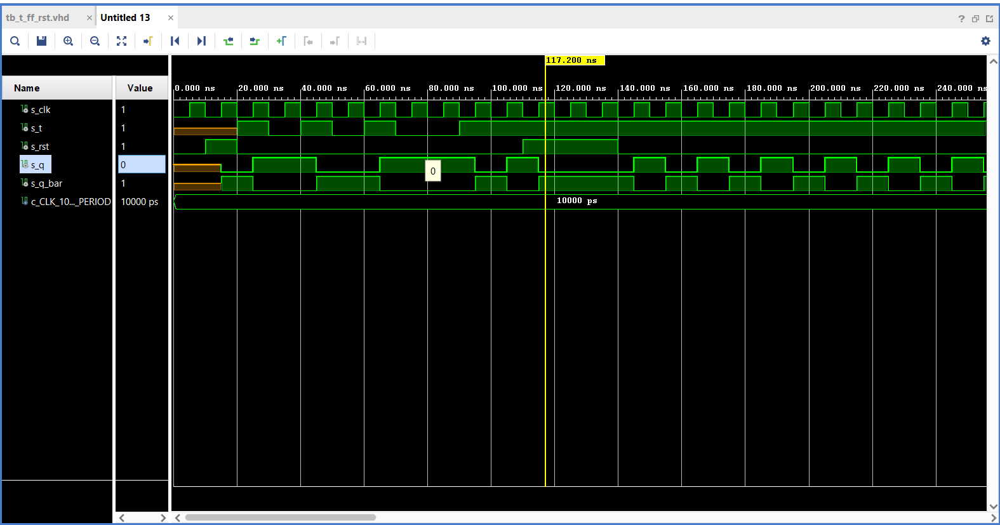

# Digital Elektronics 1

## 07 - ffs

### TASK 1

   | D | Qn | Q(n+1) | Comments |
   | :-: | :-: | :-: | :-- |
   | 0 | 0 | 0 |  |
   | 0 | 1 | 0 | Change |
   | 1 | 1 | 1 |  |
   | 1 | 0 | 1 | Change |

   | J | K | Qn | Q(n+1) | Comments |
   | :-: | :-: | :-: | :-: | :-- |
   | 0 | 0 | 0 | 0 |  |
   | 0 | 0 | 1 | 1 |  |
   | 0 | 1 | 0 | 0 | Reset |
   | 0 | 1 | 1 | 0 | Reset |
   | 1 | 0 | 0 | 1 | Set |
   | 1 | 0 | 1 | 1 | Set |
   | 1 | 1 | 0 | 1 | Toggle |
   | 1 | 1 | 1 | 0 | Toggle |

   | T | Qn | Q(n+1) | Comments |
   | :-: | :-: | :-: | :-- |
   | 0 | 0 | 0 |  |
   | 0 | 1 | 1 |  |
   | 1 | 0 | 1 | Toggle |
   | 1 | 1 | 0 | Toggle |

### TASK 2 - D-Latch

#### 2.1

```vhdl
p_d_latch : process(en, d, arst)
    begin
        if (arst = '1') then

            q       <= '0';
            q_bar   <= '1';

        elsif (en = '1') then

            q       <= d;
            q_bar   <= not d;

        end if;
    end process p_d_latch;
```

#### 2.2

```VHDL

    p_stimulus : process
    begin
        report "Stimulus process started. " severity note;
        
        s_en    <=  '0';
        s_arst  <=  '0';
        s_d     <=  '0'; 

        wait for 10 ns;
        
        s_arst  <=  '1'; -- async reset
        
        wait for 10 ns;
        
        s_arst  <=  '0'; -- async reset
        
        
        s_d     <=  '1';
        
        wait for 10ns;
        
        assert (s_q = '0' and s_q_bar = '1') report "Failed 1" severity note;
        
        s_d     <=  '0';
        
        wait for 10ns;
        
        assert (s_q = '0' and s_q_bar = '1') report "Failed 2" severity note;
        
        
        s_en    <=  '1';
        s_d     <=  '1';
        
        wait for 10ns;
        
        assert (s_q = '1' and s_q_bar = '0') report "Failed 3" severity note;
       
        s_en    <=  '1';
        s_d     <=  '0';
        
        wait for 10ns;
        
        assert (s_q = '0' and s_q_bar = '1') report "Failed 4" severity note;
        
        s_en    <=  '1';
        s_d     <=  '1';
        wait for 10ns;
        s_arst  <=  '1';
        assert (s_q = '0' and s_q_bar = '1') report "Failed 5" severity note;
        
        report "Stimulus process end. ---------------------------------------" severity note;
        wait;
    end process p_stimulus;

```

#### 2.3

==> obrázek simulace



### TASK 3

#### 3.1.1 - D-FlipFlop-arst 

```vhdl

    p_d_ff_arst : process(clk, arst)
    begin
        if (arst = '1') then

            q       <= '0';
            q_bar   <= '1';

        elsif rising_edge(clk) then

            q       <= d;
            q_bar   <= not d;

        end if;
    end process p_d_ff_arst;

```

#### 3.1.2 - D-FlipFlop-arst

```VHDL

    p_stimulus : process
    begin
        
        report "Stimulus process started." severity note;

        s_d     <=  '1';

        wait for 10ns;
        
        assert (s_q = '0' and s_q_bar = '1') report "Failed 1" severity note;
        
        s_d     <=  '0';
        
        wait for 10ns;
        
        assert (s_q = '0' and s_q_bar = '1') report "Failed 2" severity note;
        
        s_d     <=  '1';
        
        wait for 10ns;
        
        assert (s_q = '1' and s_q_bar = '0') report "Failed 3" severity note;
       
        s_d     <=  '0';
        
        wait for 10ns;
        
        assert (s_q = '0' and s_q_bar = '1') report "Failed 4" severity note;
        
        wait for 20ns;
        
        s_d     <=  '1';
        
        wait for 10ns;
        
        assert (s_q = '0' and s_q_bar = '1') report "Failed 5" severity note;
        
        report "Stimulus process ended." severity note;
        
        wait;
    end process p_stimulus;        

```

#### 3.1.3 - D-FlipFlop-arst




#### 3.2.1 - p_d_ff_rst

``` VHDL

    p_d_ff_arst : process(clk, arst)
    begin
        if (arst = '1') then

            q       <= '0';
            q_bar   <= '1';

        elsif rising_edge(clk) then

            q       <= d;
            q_bar   <= not d;

        end if;
    end process p_d_ff_arst;

```

#### 3.2.2 - p_d_ff_rst

``` VHDL

    p_stimulus : process
    begin

        report "Stimulus process started." severity note;

        s_d     <=  '1';

        wait for 10ns;

        assert (s_q = '1' and s_q_bar = '0') report "Failed 1" severity note;
        
        s_d     <=  '0';

        wait for 10ns;

        assert (s_q = '0' and s_q_bar = '1') report "Failed 2" severity note;
        
        s_d     <=  '1';

        wait for 10ns;

        assert (s_q = '0' and s_q_bar = '1') report "Failed 3" severity note;
       
        s_d     <=  '0';

        wait for 10ns;

        assert (s_q = '0' and s_q_bar = '1') report "Failed 4" severity note;
        
        wait for 20ns;

        s_d     <=  '1';

        wait for 25ns;

        assert (s_q = '1' and s_q_bar = '0') report "Failed 5" severity note;
        
        report "Stimulus process ended." severity note;
        wait;
    end process p_stimulus;

```

#### 3.2.3 - p_d_ff_rst




#### 3.3.1 - p_jk_ff_rst

```VHDL
    jk_ff_rst : process(clk)
    begin

        if rising_edge(clk) then

            if (rst = '1') then

                s_q         <=  '0';
                s_q_bar     <=  '1'; 

             else

                if (j = '0' and k = '0') then -- no change

                    s_q     <=  s_q;
                    s_q_bar <=  s_q_bar;

                elsif (j = '0' and k = '1') then -- reset

                    s_q     <=  '0';
                    s_q_bar <=  '1';

                elsif (j = '1' and k = '0') then -- set

                    s_q     <=  '1';
                    s_q_bar <=  '0';

                else

                    s_q     <=  not s_q;
                    s_q_bar <=  not s_q_bar;

                end if;
             end if;
        end if;

    end process jk_ff_rst;    
```

#### 3.3.2 - p_jk_ff_rst

```VHDL
    p_stimulus : process
    begin
        report "Stimulus process started. " severity note;
        
        s_j <=  '1';
        s_k <=  '0'; 

        wait for 10ns;

        assert (s_q = '1' and s_q_bar = '0') report "Failed 1" severity note;
        
        s_j <=  '0';
        s_k <=  '1';

        wait for 10ns;

        assert (s_q = '0' and s_q_bar = '1') report "Failed 2" severity note;
                
        s_j <=  '1';
        s_k <=  '0';

        wait for 10ns;

        assert (s_q = '1' and s_q_bar = '0') report "Failed 3" severity note;
        
        s_j <=  '0';
        s_k <=  '1';    

        wait for 10ns;

        assert (s_q = '0' and s_q_bar = '1') report "Failed 4" severity note;
        
        s_j <=  '1';
        s_k <=  '1';

        wait for 10ns;

        assert (s_q = '1' and s_q_bar = '0') report "Failed 5" severity note;
        
        s_j <=  '1';
        s_k <=  '1';

        wait for 10ns;

        assert (s_q = '0' and s_q_bar = '1') report "Failed 6" severity note;
        
        s_j <=  '1';
        s_k <=  '1';

        wait for 10ns;        

        assert (s_q = '1' and s_q_bar = '0') report "Failed 7" severity note;
        
        s_j <=  '0';
        s_k <=  '0';

        wait for 10ns;

        assert (s_q = '1' and s_q_bar = '0') report "Failed 8" severity note;
        
        report "Stimulus process ended. " severity note;
        wait;
    end process p_stimulus;
```

#### 3.3.3 - p_jk_ff_rst




#### 3.4.1. - p_t_ff_rst

```VHDL

    t_ff_rst : process(clk)
    begin

        if rising_edge(clk) then

            if (rst = '1') then

                s_q         <=  '0';
                s_q_bar     <=  '1'; 

             else

                if (t = '0') then

                    s_q     <=  s_q;
                    s_q_bar <=  s_q_bar;

                else

                    s_q     <=  not s_q;
                    s_q_bar <=  not s_q_bar;

                end if;
             end if;
        end if;
    end process t_ff_rst;

```

#### 3.4.2. - p_t_ff_rst

```VHDL

    p_stimulus : process
    begin

        report "Stimulus process started. " severity note;
        
        wait for 20 ns;

        s_t <=  '1';

        wait for 10ns;

        assert (s_q = '1' and s_q_bar = '0') report "Failed 1" severity note;
        
        s_t <=  '0';

        wait for 10ns;

        assert (s_q = '1' and s_q_bar = '0') report "Failed 2" severity note;

        s_t <=  '1';
        
        wait for 10ns;

        assert (s_q = '0' and s_q_bar = '1') report "Failed 3" 
        severity note;
        
        s_t <=  '0';
        
        wait for 10ns;
        
        assert (s_q = '0' and s_q_bar = '1') report "Failed 4" 
        severity note;
        
        s_t <=  '1';
        
        wait for 10ns;
        
        assert (s_q = '1' and s_q_bar = '0') report "Failed 5" severity note;
        
        s_t <=  '0';
        
        wait for 10ns;
        
        assert (s_q = '1' and s_q_bar = '0') report "Failed 6" severity note;
        
        s_t <=  '0';
        
        wait for 10ns;
        
        assert (s_q = '1' and s_q_bar = '0') report "Failed 6" severity note;
 
        s_t <=  '1';
        
        wait for 10ns;
        
        assert (s_q = '0' and s_q_bar = '1') report "Failed 6" severity note;
           
        report "Stimulus process ended. " severity note;
        wait;
    end process p_stimulus;

```


#### 3.4.3. - p_t_ff_rst




#### TASK 4 - PICTURE


