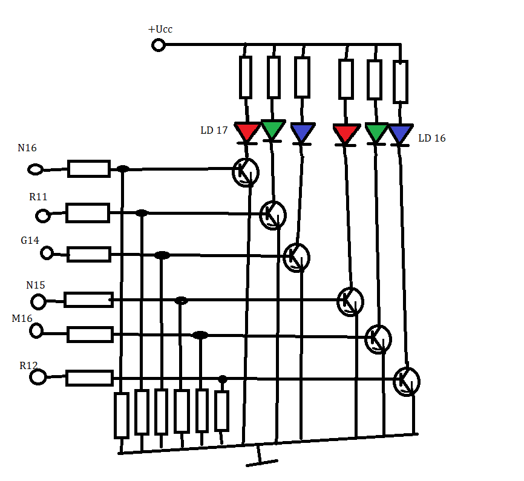
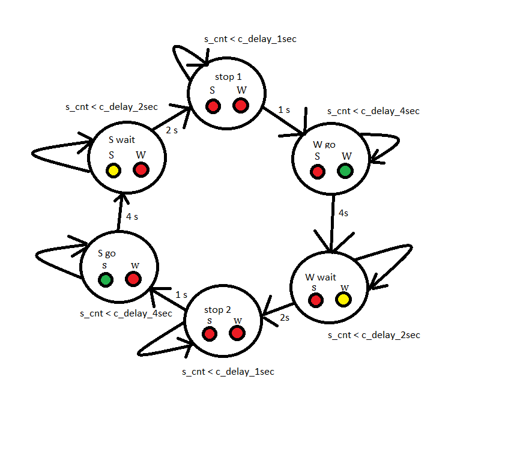
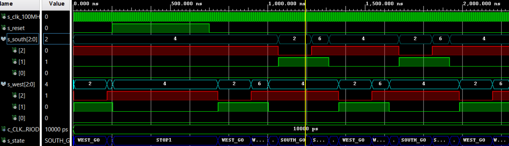

#DIGITÁLNÍ ELEKTROTECHNIKA 1


## 08 - TRAFIC LIGHTS

### TASK 1 - Preparation Task


#### 1.1 

| Input | 0 | 0 | 1 | 1 | 0 | 1 | 0 | 1 | 1 | 1 | 1 | 0 | 0 | 1 | 1 | 1 |
| :-- | :-: | :-: | :-: | :-: | :-: | :-: | :-: | :-: | :-: | :-: | :-: | :-: | :-: | :-: | :-: | :-: |
| Clock | ↑ | ↑ | ↑ | ↑ | ↑ | ↑ | ↑ | ↑ | ↑ | ↑ | ↑ | ↑ | ↑ | ↑ | ↑ | ↑ |
| State | A | A | B | C | C | D | A | B | C | D | B | B | B | C | D | B |
| Output R | 0 | 0 | 0 | 0 | 0 | 1 | 0 | 0 | 0 | 1 | 0 | 0 | 0 | 0 | 1 | 0 |

#### 1.2



#### 1.3

| RGB LED | Artix-7 pin names | Red | Yellow | Green |
| :-: | :-: | :-: | :-: | :-: |
| LD16 | N15, M16, R12 | 1,0,0 | 1,1,0 | 0,1,0 |
| LD17 | N16, R11, G14 | 1,0,0 | 1,1,0 | 0,1,0 |

### TASK 2 - MAIN TASK

#### 2.1




#### 2.2

library ieee;
use ieee.std_logic_1164.all;
use ieee.numeric_std.all;


entity tlc is
    port(
        clk     : in  std_logic;
        reset   : in  std_logic;
        -- Traffic lights (RGB LEDs) for two directions
        south_o : out std_logic_vector(3 - 1 downto 0);
        west_o  : out std_logic_vector(3 - 1 downto 0)
    );
end entity tlc;


architecture Behavioral of tlc is


    type t_state is (STOP1,
                     WEST_GO,
                     WEST_WAIT,
                     STOP2,
                     SOUTH_GO,
                     SOUTH_WAIT);

    signal s_state  : t_state;


    signal s_en     : std_logic;

    signal   s_cnt  : unsigned(5 - 1 downto 0);


    constant c_DELAY_4SEC : unsigned(5 - 1 downto 0) := b"1_0000";
    constant c_DELAY_2SEC : unsigned(5 - 1 downto 0) := b"0_1000";
    constant c_DELAY_1SEC : unsigned(5 - 1 downto 0) := b"0_0100";
    constant c_ZERO       : unsigned(5 - 1 downto 0) := b"0_0000";


    constant c_RED        : std_logic_vector(3 - 1 downto 0) := b"100";
    constant c_YELLOW     : std_logic_vector(3 - 1 downto 0) := b"110";
    constant c_GREEN      : std_logic_vector(3 - 1 downto 0) := b"010";

begin

    

    s_en <= '1';


    p_traffic_fsm : process(clk)
    begin
        if rising_edge(clk) then
            if (reset = '1') then       -- Synchronous reset
                s_state <= STOP1 ;      -- Set initial state
                s_cnt   <= c_ZERO;      -- Clear all bits

            elsif (s_en = '1') then

                case s_state is


                    when STOP1 =>

                        if (s_cnt < c_DELAY_1SEC) then
                            s_cnt <= s_cnt + 1;
                        else
                            -- Move to the next state
                            s_state <= WEST_GO;
                            -- Reset local counter value
                            s_cnt   <= c_ZERO;
                        end if;

                    when WEST_GO =>
                            if (unsigned(s_cnt) < c_DELAY_4SEC) then
                            s_cnt <= s_cnt + 1;
                        else
                            s_state <= WEST_WAIT;
                            s_cnt   <= c_ZERO;
                        end if;
                        
                    when WEST_WAIT =>
                        if (unsigned(s_cnt) < c_DELAY_2SEC) then
                            s_cnt <= s_cnt + 1;
                        else
                            s_state <= STOP2;
                            s_cnt   <= c_ZERO;
                        end if;
                        
                    when STOP2 =>
                        if (unsigned(s_cnt) < c_DELAY_1SEC) then
                            s_cnt <= s_cnt + 1;
                        else
                            s_state <= SOUTH_GO;
                            s_cnt   <= c_ZERO;
                        end if;
                        
                    when SOUTH_GO =>
                        if (unsigned(s_cnt) < c_DELAY_4SEC) then
                            s_cnt <= s_cnt + 1;
                        else
                            s_state <= SOUTH_WAIT;
                            s_cnt   <= c_ZERO;
                        end if;
                        
                    when SOUTH_WAIT =>
                        if (unsigned(s_cnt) < c_DELAY_2SEC) then
                            s_cnt <= s_cnt + 1;
                        else
                            s_state <= STOP1;
                            s_cnt   <= c_ZERO;
                        end if;


                    when others =>
                        s_state <= STOP1;

                end case;
            end if; -- Synchronous reset
        end if; -- Rising edge
    end process p_traffic_fsm;

    p_output_fsm : process(s_state)
    begin
        case s_state is
            when STOP1 =>
                south_o <= c_RED;
                west_o  <= c_RED;
                
            when WEST_GO =>
                south_o <= c_RED;
                west_o  <= c_GREEN;
                
            when WEST_WAIT =>
                south_o <= c_RED;
                west_o  <= c_YELLOW;   
            
            when STOP2 =>
                south_o <= c_RED;
                west_o  <= c_RED;
                
            when SOUTH_GO =>
                south_o <= c_GREEN;
                west_o  <= c_RED;
                
            when SOUTH_WAIT =>
                south_o <= c_YELLOW;
                west_o  <= c_RED;                

            when others =>
                south_o <= c_RED;
                west_o  <= c_RED;
        end case;
    end process p_output_fsm;

end architecture Behavioral;

#### 2.3


library ieee;
use ieee.std_logic_1164.all;


entity tb_tlc is

end entity tb_tlc;


architecture testbench of tb_tlc is


    constant c_CLK_100MHZ_PERIOD : time := 10 ns;


    signal s_clk_100MHz : std_logic;
    signal s_reset      : std_logic;
    signal s_south      : std_logic_vector(3 - 1 downto 0);
    signal s_west       : std_logic_vector(3 - 1 downto 0);

begin

    uut_tlc : entity work.tlc
        port map(
            clk     => s_clk_100MHz,
            reset   => s_reset,
            south_o => s_south,
            west_o  => s_west
        );


    p_clk_gen : process
    begin
        while now < 10000 ns loop   -- 10 usec of simulation
            s_clk_100MHz <= '0';
            wait for c_CLK_100MHZ_PERIOD / 2;
            s_clk_100MHz <= '1';
            wait for c_CLK_100MHZ_PERIOD / 2;
        end loop;
        wait;
    end process p_clk_gen;


    p_reset_gen : process
    begin
        s_reset <= '0'; wait for 200 ns;

        s_reset <= '1'; wait for 500 ns;

        s_reset <= '0';
        wait;
    end process p_reset_gen;


    p_stimulus : process
    begin

        wait;
    end process p_stimulus;

end architecture testbench;


#### 2.3




### TASK 3

#### 3.1

| Current state | Direction South | Direction West | Inputs for stay in this state or fixed delay | Inputs for  move to the next state or fixed delay |
| :-- | :-: | :-: | :-: | :-: |
| STOP1      | red    | red | 1 sec | 1 sec |
| WEST_GO    | red    | green | 00,01 | 10; 11 => 4 sec |
| WEST_WAIT  | red    | yellow | 2 sec | 2 sec |
| STOP2      | red    | red | 1 sec | 1 sec |
| SOUTH_GO   | green  | red | 00,10 | 01 ; 11 => 4 sec |
| SOUTH_WAIT | yellow | red | 2 sec | 2 sec |


#### 3.2


#### 3.3

```VHDL
library ieee;
use ieee.std_logic_1164.all;
use ieee.numeric_std.all;

entity tlc is
    port(
        clk     : in  std_logic;
        reset   : in  std_logic;
        sens_s  : in  std_logic;
        sens_w  : in  std_logic;
        
        south_o : out std_logic_vector(3 - 1 downto 0);
        west_o  : out std_logic_vector(3 - 1 downto 0)
        
    );
end entity tlc;

architecture Behavioral of tlc is

    type t_state is (STOP1,
                     WEST_GO,
                     WEST_WAIT,
                     STOP2,
                     SOUTH_GO,
                     SOUTH_WAIT);

    signal s_state  : t_state;

    signal s_en     : std_logic;

    signal   s_cnt  : unsigned(5 - 1 downto 0);

    constant c_DELAY_4SEC : unsigned(5 - 1 downto 0) := b"1_0000";
    constant c_DELAY_2SEC : unsigned(5 - 1 downto 0) := b"0_1000";
    constant c_DELAY_1SEC : unsigned(5 - 1 downto 0) := b"0_0100";
    constant c_ZERO       : unsigned(5 - 1 downto 0) := b"0_0000";

    constant c_RED        : std_logic_vector(3 - 1 downto 0) := b"100";
    constant c_YELLOW     : std_logic_vector(3 - 1 downto 0) := b"110";
    constant c_GREEN      : std_logic_vector(3 - 1 downto 0) := b"010";

begin

    s_en <= '1';
--    clk_en0 : entity work.clock_enable
--        generic map(
--            g_MAX =>        -- g_MAX = 250 ms / (1/100 MHz)
--        )
--        port map(
--            clk   => clk,
--            reset => reset,
--            ce_o  => s_en
--        );

    p_traffic_fsm : process(clk)
    begin
        if rising_edge(clk) then
            if (reset = '1') then      
                s_state <= STOP1 ;      
                s_cnt   <= c_ZERO;      

            elsif (s_en = '1') then
            
                case s_state is

                    when STOP1 =>
                    
                        if (s_cnt < c_DELAY_1SEC) then
                            s_cnt <= s_cnt + 1;
                        else
                            -- Move to the next state
                            s_state <= WEST_GO;
                            -- Reset local counter value
                            s_cnt   <= c_ZERO;
                        end if;

                    when WEST_GO =>
                            if (s_cnt < c_DELAY_4SEC) then
                            s_cnt <= s_cnt + 1;
                        else
                            if (sens_w = '1' and sens_s = '0') then  
                                s_state <= WEST_GO;
                            else
                                s_state <= WEST_WAIT;
                            end if;
                            s_cnt   <= c_ZERO;
                        end if;
                        
                    when WEST_WAIT =>
                        if (s_cnt < c_DELAY_2SEC) then
                            s_cnt <= s_cnt + 1;
                        else
                            s_state <= STOP2;
                            s_cnt   <= c_ZERO;
                        end if;
                        
                    when STOP2 =>
                        if (s_cnt < c_DELAY_1SEC) then
                            s_cnt <= s_cnt + 1;
                        else
                            s_state <= SOUTH_GO;
                            s_cnt   <= c_ZERO;
                        end if;
                        
                    when SOUTH_GO =>
                        if (s_cnt < c_DELAY_4SEC) then
                            s_cnt <= s_cnt + 1;
                        else
                           if (sens_w = '0' and sens_s = '1') then  
                                s_state <= SOUTH_GO;
                            else
                                s_state <= SOUTH_WAIT;
                            end if;
                            s_cnt   <= c_ZERO;
                        end if;
                        
                    when SOUTH_WAIT =>
                        if (s_cnt < c_DELAY_2SEC) then
                            s_cnt <= s_cnt + 1;
                        else
                            s_state <= STOP1;
                            s_cnt   <= c_ZERO;
                        end if;

                    when others =>
                        s_state <= STOP1;

                end case;
            end if; 
        end if; 
    end process p_traffic_fsm;


    p_output_fsm : process(s_state)
    begin
        case s_state is
            when STOP1 =>
                south_o <= c_RED;
                west_o  <= c_RED;
                
            when WEST_GO =>
                south_o <= c_RED;
                west_o  <= c_GREEN;
                
            when WEST_WAIT =>
                south_o <= c_RED;
                west_o  <= c_YELLOW;   
            
            when STOP2 =>
                south_o <= c_RED;
                west_o  <= c_RED;
                
            when SOUTH_GO =>
                south_o <= c_GREEN;
                west_o  <= c_RED;
                
            when SOUTH_WAIT =>
                south_o <= c_YELLOW;
                west_o  <= c_RED;                

            when others =>
                south_o <= c_RED;
                west_o  <= c_RED;
        end case;
    end process p_output_fsm;

end architecture Behavioral;
```

